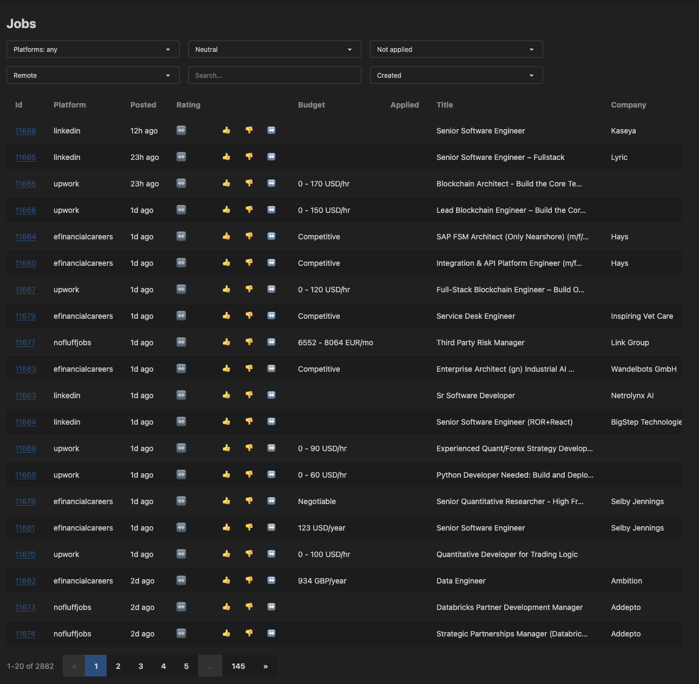
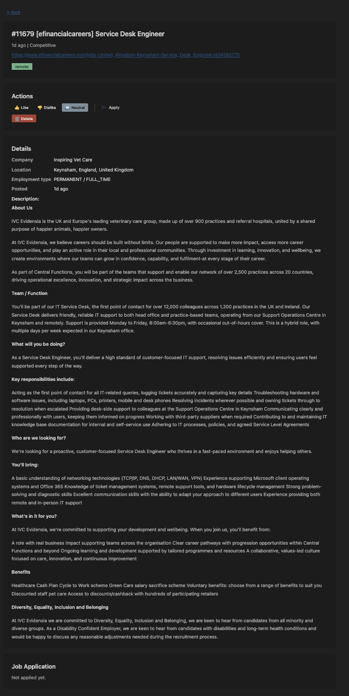
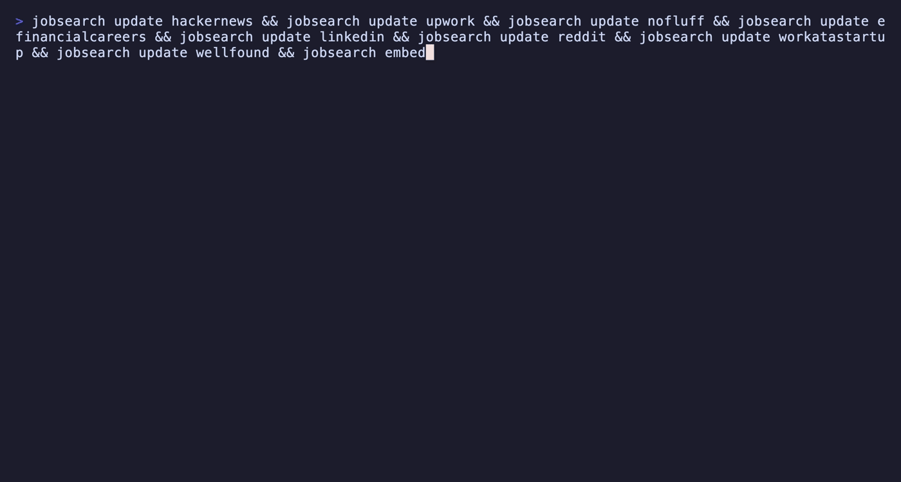

# jobsearch

Unified job search CLI that scrapes job boards, stores results in a local SQLite database, and lets you browse, rate, and semantically search postings via a terminal CLI or a web UI.

Supported providers:

- [Upwork](https://www.upwork.com/nx/search/jobs/)
- [NoFluffJobs](https://nofluffjobs.com/)
- [eFinancialCareers](https://www.efinancialcareers.com/)
- [LinkedIn](https://www.linkedin.com/jobs/)
- [Hacker News](https://hn.algolia.com/?query=who%20is%20hiring) ("Who is hiring?" threads)
- [Reddit](https://www.reddit.com/r/rust/search/?q=who%27s%20hiring) (r/rust "Who's Hiring" thread)
- [Work at a Startup](https://www.workatastartup.com/jobs)
- [Wellfound](https://wellfound.com/jobs)

## Installation

Download a prebuilt binary from [GitHub Releases](https://github.com/jozefRudy/job_search/releases). To build from source, see [Development](#development).

## How it works

All configuration lives in a single TOML file. `jobsearch init` writes a sample config to the standard config directory:

- **macOS**: `~/Library/Application Support/jobsearch/jobsearch.toml`
- **Linux**: `~/.config/jobsearch/jobsearch.toml`

The database (`jobsearch.db`, SQLite) and vector embeddings (Lance) live in the corresponding data directory (`~/Library/Application Support/jobsearch/` on macOS, `~/.local/share/jobsearch/` on Linux).

### Configuration by URL, not CLI args

Search customization is done **in the config file, not via command-line arguments** — by design. Each provider gets a list of `urls`; the URL parameters (keywords, salary filters, remote-only, date ranges, etc.) define what gets scraped. Want different results? Edit the URL in `jobsearch.toml`.

```toml
location = "Europe"
pause_ms = 2000

[browser]
bin = "/Applications/Brave Browser.app/Contents/MacOS/Brave Browser"

[llm]
bin = "pi --print --no-session --no-tools --no-extensions --mode text --thinking off --model deepseek/deepseek-v4-flash"

[providers.nofluffjobs]
urls = ["https://nofluffjobs.com/remote?criteria=employment%3Db2b%20salary%3Eeur8000m%20jobLanguage%3Den&sort=newest"]

[providers.upwork]
urls = ["https://www.upwork.com/nx/search/jobs/?q=trading&sort=recency&per_page=50&t=0&hourly_rate=60-"]
```

Scraping runs through a real Chromium-based browser (configured under `[browser]`), driven over CDP. Before running `update`, make sure the browser is running with a tab open on the target site — and that you're logged in where required (Upwork, LinkedIn, Work at a Startup). Commands attach to the running browser session.

## Workflow

```bash
# 1. One-time setup: create sample config, launch browser, open provider tabs
#    (edit the config first if your browser binary path differs)
jobsearch init

# 2. Fetch fresh postings from a provider (run for each provider you use)
jobsearch update nofluff
jobsearch update upwork
jobsearch update efinancialcareers
jobsearch update hackernews
jobsearch update linkedin
jobsearch update reddit
jobsearch update workatastartup
jobsearch update wellfound
```

Example output:

```text
Fetching from hackernews: https://hn.algolia.com/api/v1/search_by_date
    Fetched 276 top-level HN comments
    Total checked: 0 (0 new, 0 existing, 0 skipped)
Fetching from upwork: https://www.upwork.com/nx/search/jobs/?q=trading&sort=recency&per_page=50&t=0&hourly_rate=60-
    Bot check at https://www.upwork.com/nx/search/jobs/?q=trading&sort=recency&per_page=50&t=0&hourly_rate=60-. Waiting up to 30s for user to solve...
    Bot check cleared, resuming.
    Total checked: 68 (2 new, 66 existing, 0 skipped)
Fetching from efinancialcareers: https://www.efinancialcareers.com/jobs/remote/python?pageSize=50&filters.postedDate=SEVEN&language=en
    Total checked: 28 (2 new, 10 existing, 16 skipped)
Fetching from linkedin: https://www.linkedin.com/jobs/search/?f_I=4&f_T=39&f_TPR=r200000&f_WT=2&geoId=92000000
    Total checked: 333 (13 new, 319 existing, 1 skipped)
```

```bash
# 3. Embed new postings for semantic/vector search
jobsearch embed            # incremental; --force to re-embed everything

# 4. Browse and search everything in the web UI (default port 8080)
jobsearch serve            # or: jobsearch serve --port 3000
```

Open `http://localhost:8080` — the UI shows all jobs in one unified view with sorting, filtering, and vector search. The backend embeds the compiled SolidJS frontend, so no separate frontend process is needed.

### Screenshots

Job list:



Job detail:



Embeddings use `nomic-ai/nomic-embed-text-v1.5` via fastembed (runs locally, no API key needed). Vectors are stored in Lance; only jobs not yet vectorized are embedded on each run.

Check what's taking up space (SQLite size, downloaded models, Lance datasets, total jobs):

```bash
jobsearch diagnose
```

Example output:

```text
/Users/jozefrudy/Documents/projects/job_search/jobsearch.db: 17.35 MB
./models/models--nomic-ai--nomic-embed-text-v1.5: 522.64 MB
./lance/embeddings-nomic-ai-nomic-embed-text-v1.5: 22.99 KB
Total jobs: 1912
```

## Demo



## Development

A Nix devenv shell is provided (`devenv.nix`) with all dependencies, including `cargo sqlx prepare` for offline SQLx builds (`.sqlx/` is committed).

```bash
cargo build && cargo clippy --all-targets && cargo test && cargo fmt
```

Frontend (for development): SolidJS + TanStack Query, API types generated from the backend's OpenAPI spec via orval.

```bash
cd frontend && pnpm install && pnpm typecheck && pnpm test run && pnpm build
```

## License

MIT
